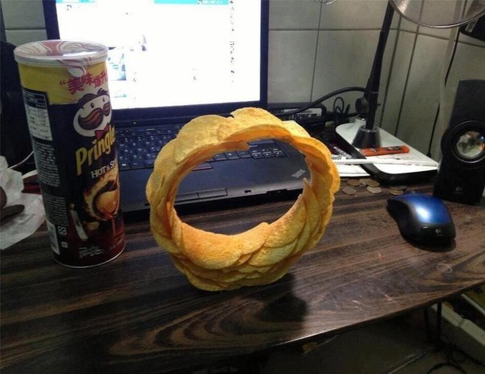

# Advanced-Project
Yeah, no idea what this project will be about. It's for 02830 Advanced Project in Digital Media Engineering tho.

## Resources
* [Course "Playbook"](02830Playbook.pdf)

## Notes from lecture one
During the work, stay agile. Plan <-> Execute should be continuous loop.

When you have an idea of the project update this stuff regularly:
* Motivation
* Goal
* Delimitation

Literature sucks, but do some research.

## Learning goals:
* Analyze a technical problem
* Collect information
* Plan a project
* Test success
* Prepare a report

## Projects:
* Tangible 3D modeling
* Translation
* Hearing aids
* Spiral Data Visualization
